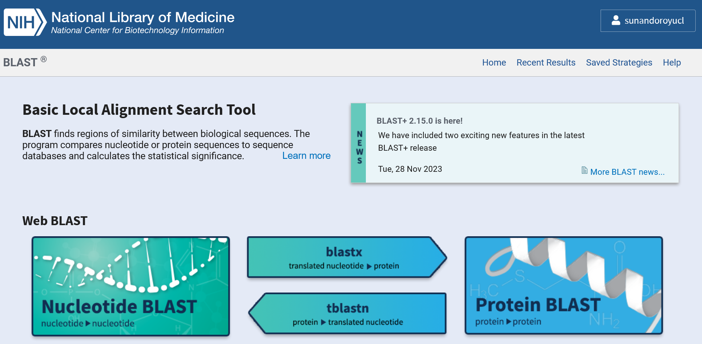
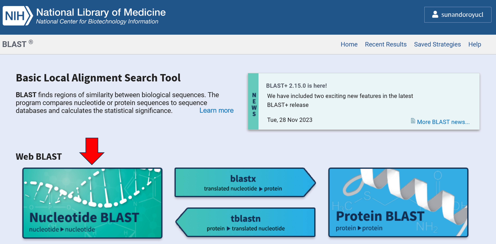
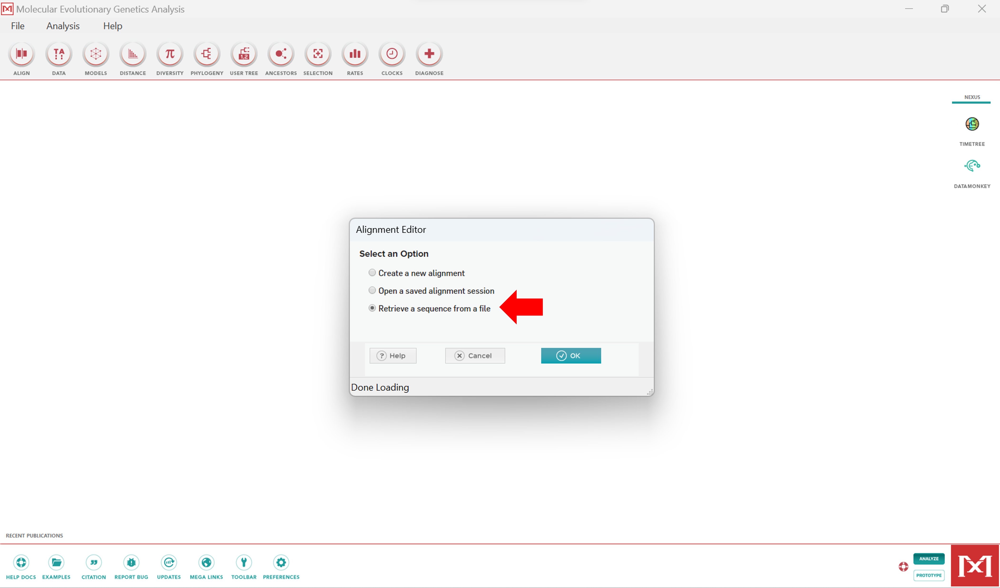
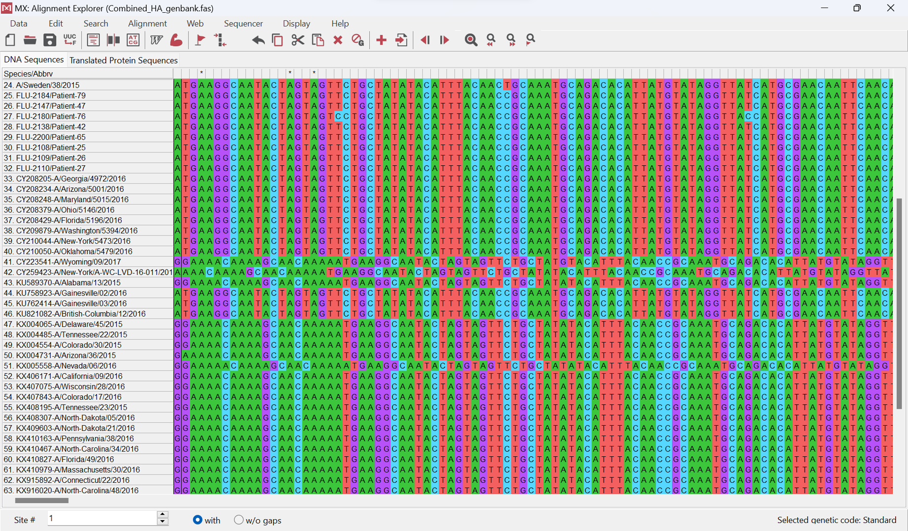
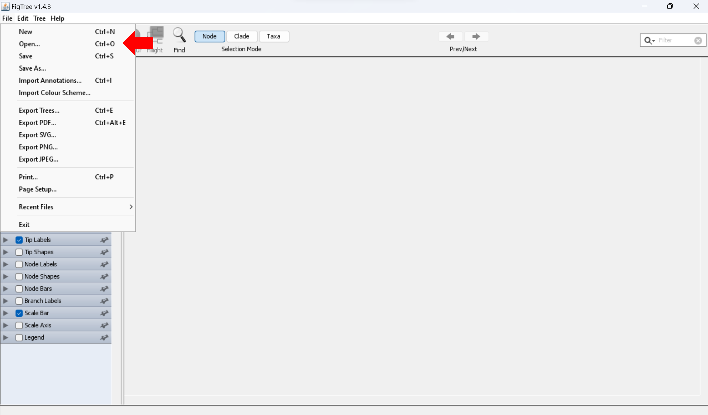
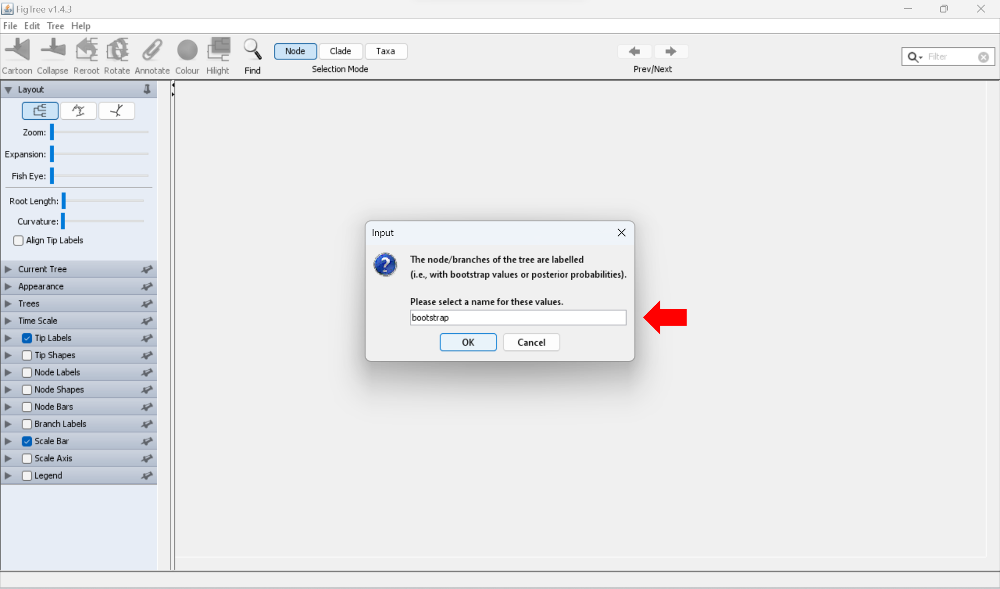
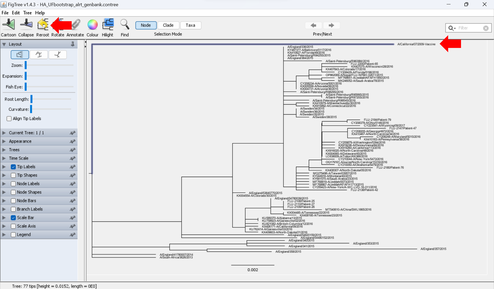
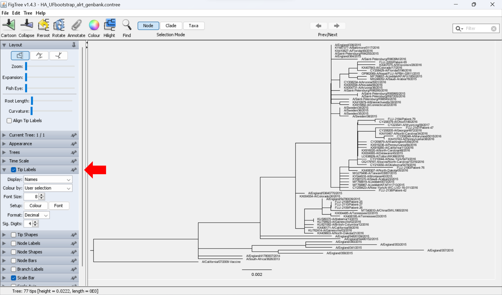
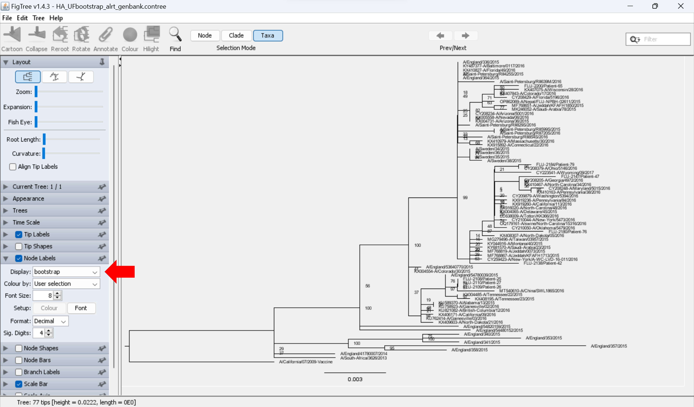
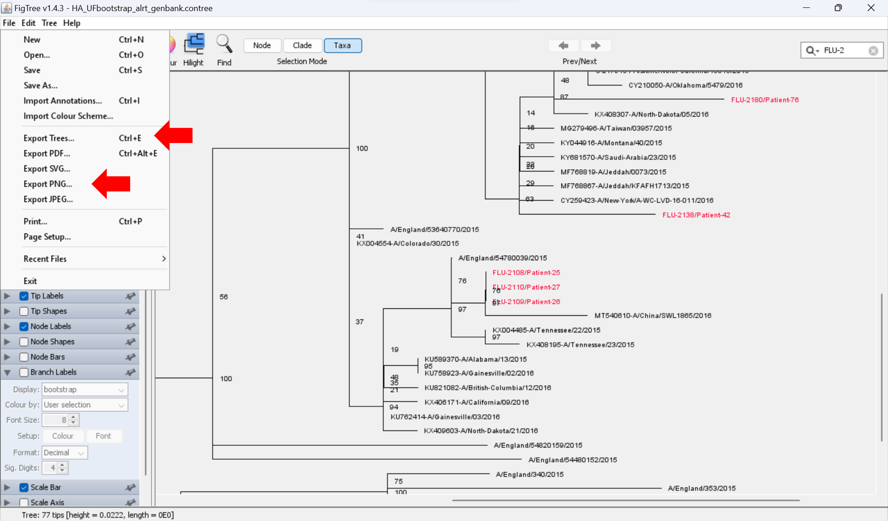

## Scenario 3 – Retrieval of sequences and phylogenetic analysis

**There has been a recent spike in Influenza cases in your local
hospital. The clinicians are worried there may be an outbreak and ward
to ward transmission. They have asked you to sequence the virus from
clinical samples to determine if they are related.**

**For this practical we will use the HA sequence of the viruses to
identify whether an outbreak has occurred at the hospital. The file used
is Hospital_HA.fas**

**Note** We have NA sequences also available if you would like to repeat
the practical later on your own. The naming convention used is similar
to the HA example. All files can be found in the **Example_Data**
sub-folder.

**Software used in this session**  
  
1. **Mafft** - Alignment Tool  
2. **MEGA** - Alignment Viewer and Editor  
3. **Modeltest-ng** - Model Testing  
4. **IQ-TREE** - Tree Building  
5. **Figtree** - Tree Viewer and Editor  
<br> <font size="4">**Step 1 - Downloading related sequences.**</font>  
<br>

``` bash
cd ~/Phylogenetics
ls
cp Example_Data/Hospital_HA.fas .
ls
```

<br> **Website** - Genbank <https://www.ncbi.nlm.nih.gov/genbank/>  
<br> <br>   
<br> <br> <br>   
<br> <br> <br>   
<br> <br> <br>   
<br> <br> <br>   
<br> <br> <br>   
<br> <br> <br>   
<br> <br> <br> Navigate to the phylogenetics folder and upload the
**Hospital_HA.fas** file.  
<br> <br> <br>   
<br> <br> <br>   
<br> <br> <br>   
<br> <br> <br> You can browse the hits for each reference sequence by
clicking on the bar and selecting the strain of interest in the dropdown
menu.  
<br> <br> <br>   
<br> <br> <br> Scroll down to select the top hits for each reference
sequence.  
<br> <br> <br>   
<br> <br> <br>   
<br> <br> <br> For each sequence run using Blast we can download
corresponding 10 closest hit. We have already downloaded this for every
sequence and saved in the **Example_Data** folder with the sequence
number as the file name. You can open these files in any text editor
(GUI) or using nano from the terminal.  
<br> We have the file header cleaned up and available along with some
other sequences from GISAID in the file named
**Combined_HA_genbank.fas**  
<br> **Alternate Ways to Download from GenBank**  
<br> **Batch Entrez**
(<https://www.ncbi.nlm.nih.gov/sites/batchentrez>)  
<br> To test batch downloads we will create a file with the 3 Accession
numbers KX004485,MT540610,KU821082  
<br> Use your skills learnt in the course so far to create a file in the
**~/Phylogenetics/** folder called Entreztest.txt with the 3 Accession
numbers above and use batchentrez to download the sequences. Each
Accession number should be in a new line in the file.  
<br> <br> <br>   
<br> <br> <br>   
<br> <br> <br>   
<br> <br> <br>   
<br> <br> <br> **Entrez E-utilities**
<ftp://ftp.ncbi.nlm.nih.gov/entrez/entrezdirect/>  
<br> **Manual** - <https://www.ncbi.nlm.nih.gov/books/NBK179288/>  
<br> **QuickStart** -
<http://bioinformatics.cvr.ac.uk/blog/ncbi-entrez-direct-unix-e-utilities/>  
<br> <br> <br> **Browser**

``` bash
#To Download 4 SARS-CoV2 genomes as an example
https://eutils.ncbi.nlm.nih.gov/entrez/eutils/efetch.fcgi?db=nucleotide&id=AY278488, AY304486, MN908947, MT782115&rettype=fasta&retmode=text
```

<br> **Terminal**

``` bash
#To download all complete L protein of taxon rhabdoviridae from Refseq
cd ~/Phylogenetics

esearch -db "protein" -query "txid11270[Organism] AND L Protein Complete AND refseq[filter]" | efetch -format fasta > esearchoutput.fasta

grep '>' esearchoutput.fasta
```

<br> <br> <font size="4">**Step 2 – Aligning Sequences.**</font>  
<br> <br> **Software Used**  
<br> **Mafft** (<https://mafft.cbrc.jp/alignment/software/>)

**MEGA** (<https://www.megasoftware.net/>)

**Alternate Software** – MUSCLE, CLUSTALW  
<br> To view/edit sequence files we will use MEGA. MEGA has a GUI and
will launch as a standalone program. Before we start we will first copy
over the dataset that includes our hospital sequences and all the
reference strains we have downloaded. The file name is
**Combined_HA_genbank.fas**  
<br> **Make sure you are in the Phylogenetics folder for this part of
the practical**  
<br>

``` bash
cd ~/Phylogenetics

cp Example_Data/Combined_HA_genbank.fas .

#To Launch MEGA
mega
```

<br> <br> <br>   
<br> <br> <br>   
<br> <br> <br>   
<br> <br> <br>   
<br> <br> <br> We are now going to use mafft to align the file. You can
use any file name you prefer in place of outputfile.fas below.  
<br>

``` bash
cd ~/Phylogenetics

mafft Combined_HA_genbank.fas > outputfile.fas
```

<br> This uses the default models to align the sequences. For highly
divergent sequences this may produce inaccurate alignments.

Alternatives are if you have a curated alignment mafft –add works to add
new sequences to existing alignments which puts more weightage on the
existing alignment.

We can also use the L-INS-i algorithm in Mafft that aligns more
divergent sequences using pairwise local alignments.

Once the alignment is complete you can open and view the aligned file in
MEGA by repeating the steps above. You can continue to build a tree
using the file you just created. Just remember to use the file name of
your output in the commands below. We will be using the file
**Combined_HA_genbank_aln.fas**  
<br>

``` bash
cd ~/Phylogenetics

cp Example_Data/Combined_HA_genbank_aln.fas .

ls
```

<br> <br> <font size="4">**Step 3 – Constructing a Phylogeny.**</font>  
<br> <br> **Software Used**  
<br> **Modeltest-ng** (<https://github.com/ddarriba/modeltest>)

**IQ-TREE** (<http://www.iqtree.org/>)

**Alternate Software** – PhyML,RAxML  
<br> For this session we will start with the aligned nucleotide
sequences created in the last step. You can use the alignment you have
created or the file already prepared for you
**Combined_HA_genbank_aln.fas**  
<br> **Model Testing**  
<br> To run model testing we will use Modeltest-ng. You can use any
filename in place of **modeloutputfile** below.  
<br>

``` bash
cd ~/Phylogenetics

modeltest-ng -d nt -i Combined_HA_genbank_aln.fas -o modeloutputfile -t ml -p 2
```

Where:  
-d : datatype  
-i : Input file  
-o : Output file  
-t : Sets the starting tree topology  
-p : Number of threads  
<br> We test three criteria to select the best fitting models BIC, AIC
and AICc. The modeltest results for this alignment are in
~/Phylogenetics/Example_Data/HA_model.out  
<br>

``` bash
less ~/Phylogenetics/Example_Data/HA_model.out
```

<br> <br>   
<br> <br> **Tree building**  
<br> To build a tree we are going to use IQ-TREE. You can use any output
file name in place of **treefileout**  
<br>

``` bash
cd ~/Phylogenetics

iqtree -s Combined_HA_genbank_aln.fas -bb 1000 -st DNA -nt 4 -alrt 1000 -pre treefileout
```

where:  
-s : Input File  
-bb : ultrafast bootstrap  
-st : data type  
-nt : Number of threads  
-alrt : SH-like approximate likelihood ratio test  
-pre : Prefix for output file  
<br> IQ-TREE outputs multiple files. The final tree file we will use has
an extension of **.contree.** The final output file that we will take
for tree viewing and editing is
**HA_UFbootstrap_alrt_genbank.contree**  
<br> <br> <font size="4">**Step 4 – Viewing and Modifying a Tree
File.**</font>  
<br> <br> **Software Used**

**FigTree** (<http://tree.bio.ed.ac.uk/software/figtree/>)

**Alternate Software** MEGA (<https://www.megasoftware.net/>)

Figtree is Java based and will launch a GUI

``` bash
cd ~/Phylogenetics

cp Example_Data/HA_UFbootstrap_alrt_genbank.contree .

#To launch figtree
figtree
```

<br> <br> <br>   
<br> <br> <br>   
<br> <br> <br>   
<br> <br> <br>   
<br> <br> <br> We will root the tree using the
**A/California/07/2009-Vaccine Strain**. This is an unrelated strain of
the same genotype.  
<br> <br> <br>   
<br> <br> <br>   
<br> <br> <br> You can change the font type or size under **Tip
Labels**  
<br> <br> <br>   
<br> <br> <br> You can add the bootstrap values under **Node Labels**  
<br> **Note** - We are using ultrafast bootstrap so values over 90 is
considered significant. aLRT values above 80-85 is considered
significant and can be found in the .treefile. If you use regular
bootstrap with the -b option you can use 70 as a cutoff.  
<br> <br> <br>   
<br> <br> <br> You can select our hospital strains and colour them by
searching for **FLU-2** in the search bar above to highlight first and
then colour the taxa.  
<br> <br> <br>   
<br> <br> <br> Once highlighted we can find the hospital strains
scattered across the tree, except the 3 strains below. They form one
cluster and are identical in sequence suggesting a potential outbreak.  
<br> <br> <br>   
<br> <br> <br> We can export the trees either in standard Nexus or
Newick format. Trees can also be exported as PDFs or image formats like
jpg.  
<br> <br> <br>   
<br> <br> <br> We can further process the trees in
**PowerPoint/ggtree/Illustrator** or other image editing tools to add
metadata for each sequence in the alignment.  
<br> <br>
